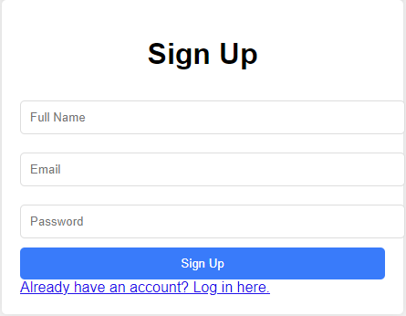

# Note.me

## Overview (Capstone Project for my Applied Internet Technology class)

Project can be accessed here: [link](https://master.d2st5pmceso7n9.amplifyapp.com/)

Organizing your goals and tasks that you need to complete is an essential part of building a more productive and healthier life. Note.me is a web application that allows you to keep track of any responsibility you need to do as well as containing a platform for effective note-taking. 

Users will have two different tabs, one as a To-Do List where users can set daily or weekly goals they want to achieve. These goals can be marked as complete or incomplete and analytics will be provided based on these specific goals.

The second tab will contain a note-taking feature that allows users to take notes both effectively and efficiently through the help of supplementary AI tools.

## Update for implementation
NOTE: For the final project implementation, I will not implement the to-do list side of the application, this application will only have a login/register feature and a note-taking feature. 
This should still fulfill the requirements for AJAX interactions and the mongoose schemas with a User Schema and a Notes Schema.

## Data Model

The application will store Users, and Notes

* users can have multiple lists (via references)
* each list can have multiple items (by embedding)

An Example User:

```javascript
{
  username: "javascriptfannumber1",
  hash: // a password hash,
  notes: // an array of references to note documents
}
```
An Example Note Document:

```javascript
{
  user: // a reference to a User object
  name: "AIT Notes",
  postedDate: Date.now() when the note is created
  updatedDate: Date.now() when the note is updated
  text: "JavaScript is so weird! Firstly, it is a weakly typed language. Also, wat are prototypes??!?!"
}
```

## [Link to Commented First Draft Schema](db.mjs) 

## Wireframes

/weeklyList - page for showing and editing weeklyList and Tasks


/notes - page for showing notes of a user


/login - page for logging in


/sign-up - page for signing up



## Site map


## User Stories or Use Cases

1. as non-registered user, I can register a new account with the site
2. as a user, I can log in to the site
3. as a user, I can create a new notes page
4. as a user, I can write to and make edits to a note page
5. as a user, I can delete note pages
6. as a user, I can access a single note page by clicking on a tab.

## Research Topics

* (6 points) Next.js
    * Next.js is a frontend framework. Want to use it to develop an interactive UI for the web app.
* (6 points) AWS Deployment
    * Deploying my application onto two AWS services.
    * My frontend (Next.js) is deployed onto AWS Amplify, and my backend (Express.js) is deployed onto AWS EC2.
* (3 points) Docker, Containerization
    * Used Docker to containerize my application to deploy my frontend onto AWS Amplify. My Docker Container is registered onto AWS ECR (Elastic Container Registry).

## Milestone #2 Form Proof
Before:


After:


## Annotations / References Used

1. [tutorial on deploying to ec2](https://www.youtube.com/watch?v=7vf210p2tJg)
2. [tutorial on https connection from frontend to ec2](https://www.youtube.com/watch?v=q-XEGbipOVw)
