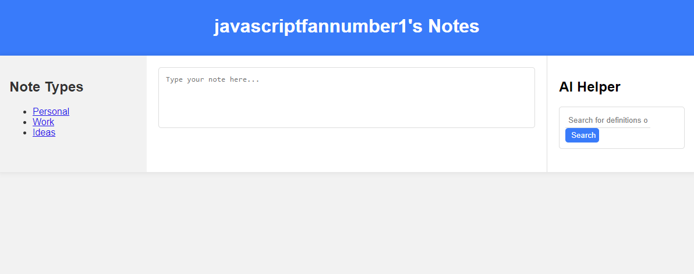

# Life+

## Overview

(__TODO__: a brief one or two paragraph, high-level description of your project)

Organizing your goals and tasks that you need to complete is an essential part of building a more productive and healthier life. LifePremium is a web application that allows you to keep track of any responsibility you need to do as well as containing a platform for effective note-taking. 

Users will have two different tabs, one as a To-Do List where users can set daily or weekly goals they want to achieve. These goals can be marked as complete or incomplete and analytics will be provided based on these specific goals.

The second tab will contain a note-taking feature that allows users to take notes both effectively and efficiently through the help of supplementary AI tools.

## Data Model

The application will store Users, Tasks, WeeklyLists, and Notes

* users can have multiple lists (via references)
* each list can have multiple items (by embedding)

An Example User:

```javascript
{
  username: "javascriptfannumber1",
  hash: // a password hash,
  weeklyLists: // an array of references to weeklyLists documents
  notes: // an array of references to note documents
}
```

An Example weeklyList with Embedded Tasks:

```javascript
{
  user: // a reference to a User object
  tasks: [
    { name: "exercise", duration: "30:00", checked: false},
    { name: "AIT HW", partsCompleted: "4/4", checked: true},
  ],
  createdAt: // timestamp
}
```
An Example Note Document:

```javascript
{
  user: // a reference to a User object
  name: "AIT Notes",
  text: "JavaScript is so weird! Firstly, it is a weakly typed language. Also, wat are prototypes??!?!"
}
```

## [Link to Commented First Draft Schema](db.mjs) 

## Wireframes

/weeklyList - page for showing and editing weeklyList and Tasks


/notes - page for showing notes of a user



/login - page for logging in


/sign-up - page for signing up


## Site map


## User Stories or Use Cases

1. as non-registered user, I can register a new account with the site
2. as a user, I can log in to the site
3. as a user, I can create a new notes page
4. as a user, I can write to and make edits to a note page
5. as a user, I can add tasks to a weeklyList
6. as a user, I can access my tasks and checkoff completed tasks

## Research Topics

* (6 points) Next.js
    * Next.js is a frontend framework. Want to use it to develop an interactive UI for the web app.
* (2 points) Tailwind.css
    * Tailwind.css is a css framework. Want to use it to develop a consistent css styling scheme throughout my web app.
* (1-2 point) External API (OpenAI's API)
    * Want to use OpenAI's AI Model to serve as a supplementary tool for note taking for my web app.

## [Link to Initial Main Project File](app.mjs) 

## Annotations / References Used

(__TODO__: list any tutorials/references/etc. that you've based your code off of)

1. [passport.js authentication docs](http://passportjs.org/docs) - (add link to source code that was based on this)
2. [tutorial on vue.js](https://vuejs.org/v2/guide/) - (add link to source code that was based on this)

